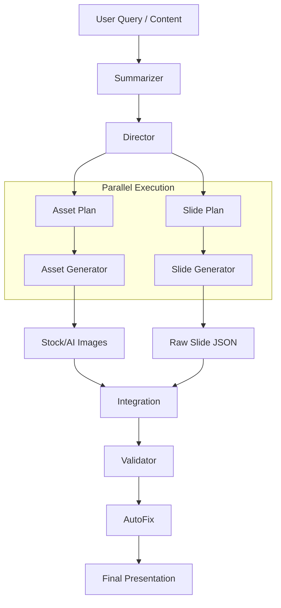

# AI Generation Flow Architecture

This document outlines the high-level flow of the AI presentation generation pipeline in Clarity.

## Core Pipeline (`lib/ai/pipeline.ts`)

The pipeline orchestrates the generation process in a linear flow, transforming a user query into a final slide deck.

## Key Components

### 1. Summarizer (`summarizer.ts`)
*   **Input**: User query, uploaded files, or URLs.
*   **Role**: Distills complex content into a structured summary with key points and intent.
*   **Model**: Gemini Flash Lite (Fast & Cheap).

### 2. Director (`director.ts`)
*   **Input**: Summary & Theme.
*   **Role**: Creative Director. Plans the narrative arc, decides slide types (Title -> Problem -> Solution), and dictates the visual style.
*   **Output**: A detailed `DirectorPlan` containing batches of slides and asset directives.
*   **Model**: Gemini Flash (Balanced).

### 3. Asset Generator (`assetGenerator.ts` + `stock-registry.ts`)
*   **Input**: Asset Directives from Director.
*   **Role**: Visual Fulfillment.
    *   **AI Mode**: Generates prompts for Imagen 3.
    *   **Stock Mode**: Matches keywords (e.g., "Mars", "Future") to high-quality curated Unsplash images.
*   **Output**: Map of `AssetID -> ImageURL`.

### 4. Slide Generator (`slideGenerator.ts`)
*   **Input**: Slide Plan & Scene Guidance.
*   **Role**: Coder. Writes the actual JSON structure for each slide, choosing layouts, colors, and determining where text/images go.
*   **Model**: Gemini Flash (Instruction Following).

### 5. Validator (`validator.ts`)
*   **Input**: Generated Slides.
*   **Role**: Quality Assurance. Checks for JSON errors, missing fields, or broken layouts. Can auto-fix common issues.

## Infrastructure

*   **Worker**: `worker/ai/index.ts` runs the pipeline in a background job (RabbitMQ).
*   **Logging**: `lib/ai/logger.ts` captures detailed execution traces to `logs/ai-logs/`.
*   **Storage**: MinIO (S3-compatible) stores generated assets.
