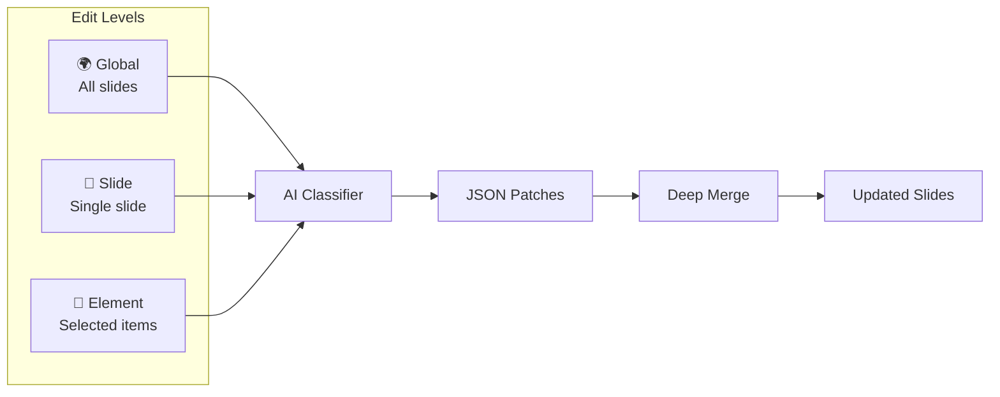
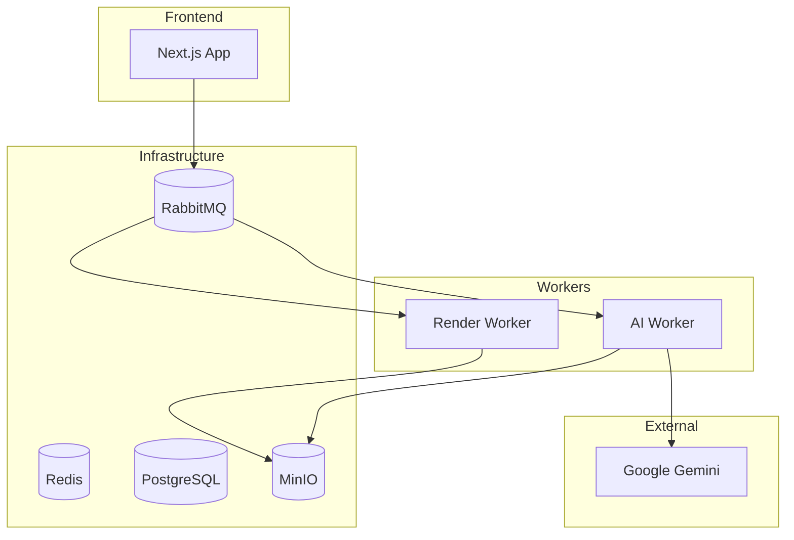
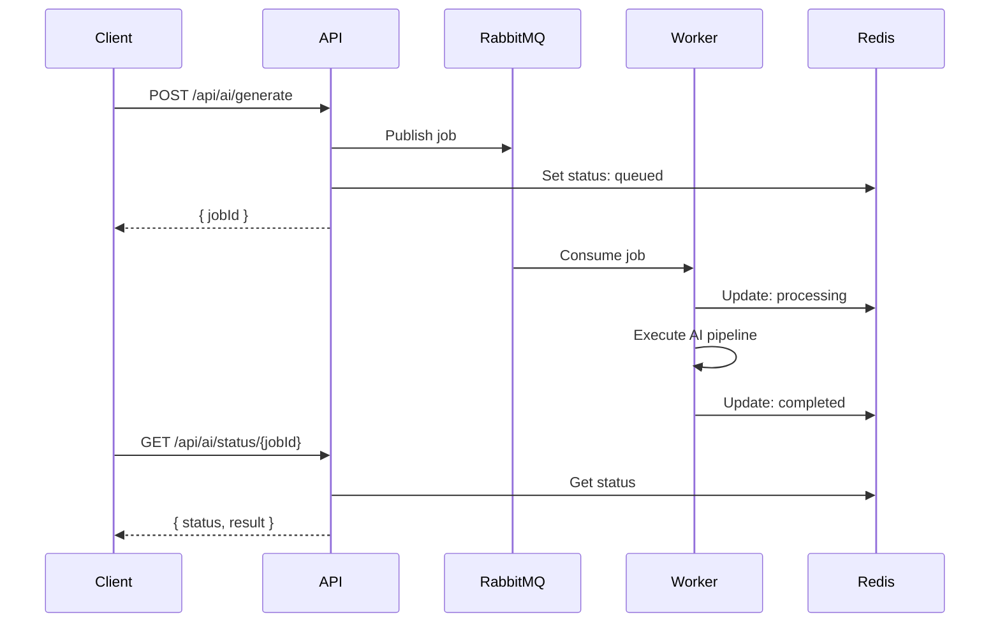
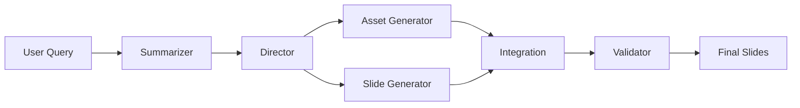

<div align="center">

# 🎬 OpenScenes

### AI-Powered Video Presentation Engine

*Transform ideas into stunning video presentations with AI-driven generation and professional rendering.*

[](https://nextjs.org/)
[](https://www.typescriptlang.org/)
[](https://remotion.dev/)
[](https://ai.google.dev/)


</div>

---

## ✨ Features

- 🧠 **AI Generation** — Multi-agent pipeline transforms prompts into complete presentations
- ✏️ **Intelligent Editing** — Natural language editing at global, slide, and element levels
- 🎥 **Video Export** — Distributed render engine with Remotion
- 🎨 **Theme Engine** — 10+ curated visual themes with AI-aware styling
- 📁 **File Context** — Upload documents (PDF, MD, CSV) for AI-informed generation
- ⚡ **Real-time Preview** — Interactive canvas with drag-and-drop editing

---

## 🛠️ Tech Stack

| Layer | Technologies |
|-------|-------------|
| **Frontend** | Next.js 15, React 19, TypeScript, Framer Motion |
| **AI** | Google Gemini 2.0, Vertex AI (Imagen 3) |
| **Video** | Remotion 4, WebCodecs API |
| **Infrastructure** | RabbitMQ, Redis, PostgreSQL, MinIO (S3) |
| **DevOps** | Docker, Docker Compose |

---

## ✏️ Tiered Edit System

Natural language editing at three granularity levels:



**Examples:**
- 🌍 *"Make all headlines use brand color #6366f1"*
- 📄 *"Convert this slide to a two-column comparison"*
- 🔲 *"Make the selected text larger and bold"*

---

## 🏗️ Architecture



### ⚡ Event-Driven Architecture

The system uses a **distributed, event-driven architecture** for scalable async processing:

| Component | Technology | Purpose |
|-----------|------------|---------|
| **Message Queue** | RabbitMQ | Decouples API from workers, enables horizontal scaling |
| **Job Status** | Redis | Real-time status polling, pub/sub for cancellation |
| **Workers** | Node.js | Stateless consumers that process AI/render jobs |
| **Storage** | MinIO (S3) | Object storage for assets and rendered videos |



---

## 🧠 AI Pipeline



| Agent | Model | Purpose |
|-------|-------|---------|
| **Summarizer** | Gemini Flash Lite | Extract intent and key points |
| **Director** | Gemini Flash | Plan narrative and visual style |
| **Slide Generator** | Gemini Flash | Generate slide JSON |

---

## 📁 Project Structure

```
├── app/                    # Next.js App Router
│   ├── api/ai/            # AI endpoints
│   ├── api/render/        # Render endpoints
│   └── generate/          # Dashboard & editor
├── worker/
│   ├── ai/                # AI generation worker
│   └── render/            # Video render worker
├── remotion/              # Video composition
└── docker-compose.yml     # Full stack setup
```

---

## 🚀 Quick Start

```bash
# Install dependencies
npm install

# Start infrastructure
docker-compose up -d

# Setup environment
cp .env.example .env.local

# Setup Google Cloud Credentials (required for Vertex AI)
# Place your service-account.json in the root directory
# OR set GOOGLE_APPLICATION_CREDENTIALS in .env to your local path

# Run development server
npm run dev

# Run workers (separate terminals)
npm run worker:ai
npm run worker:render
```

---

## 📊 Editor


---

## 📖 Documentation

- [API Reference](docs/API.md)
- [AI Worker](worker/ai/README.md)
- [Render Worker](worker/render/README.md)

---

<div align="center">

** Built with Next.js, Remotion, and Google Gemini**

</div>
