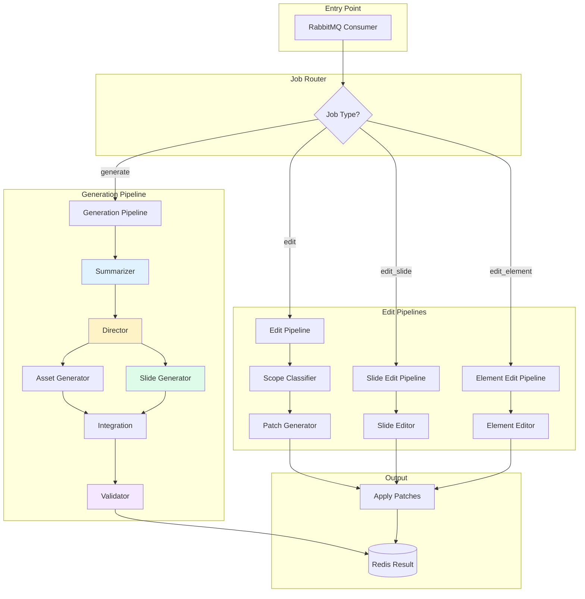
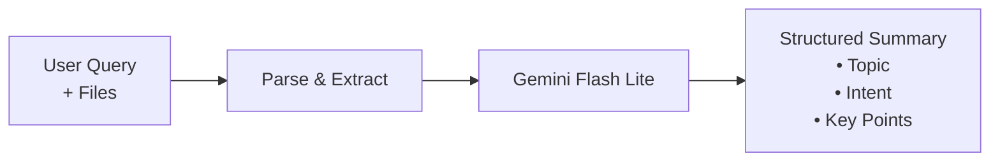
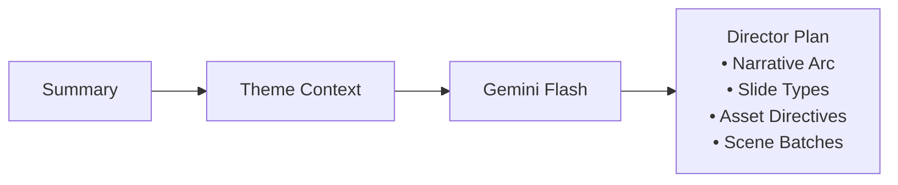
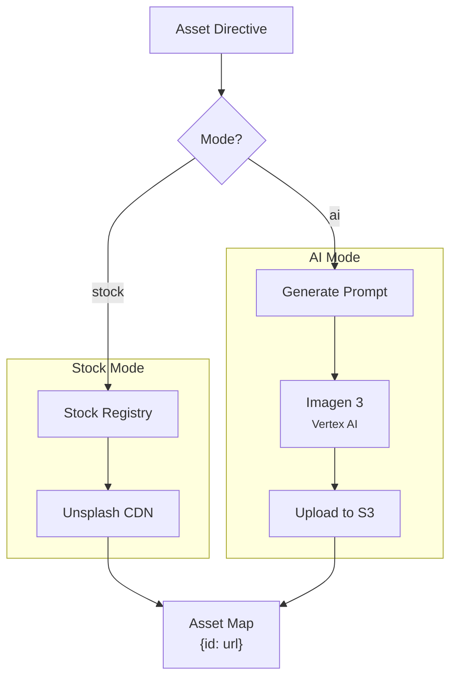
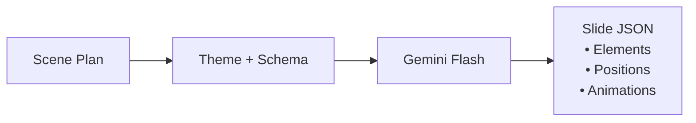
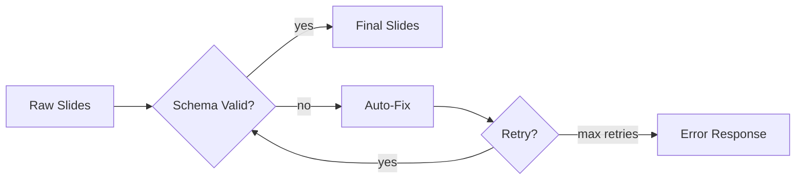
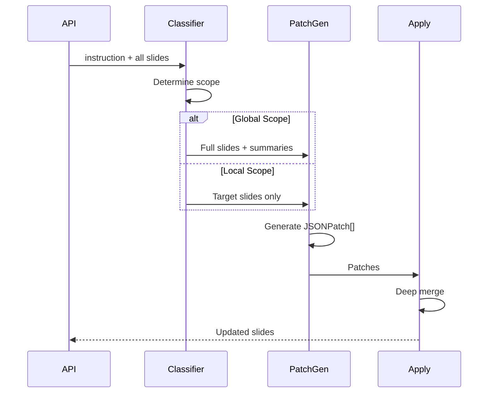
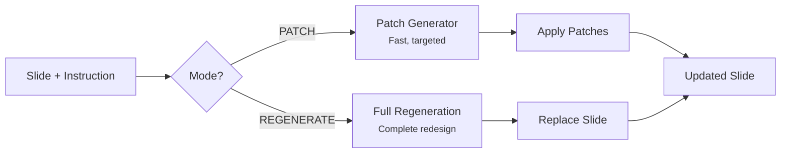

# AI Worker

The AI Worker handles all AI-powered generation and editing tasks for presentations.

## Architecture



## Pipeline Stages

### 1. Summarizer


**Model:** `gemini-2.0-flash-lite`  
**Purpose:** Distills complex content into actionable summary

### 2. Director


**Model:** `gemini-2.0-flash`  
**Purpose:** Creative planning - decides structure and visual strategy

### 3. Asset Generator


### 4. Slide Generator


**Model:** `gemini-2.0-flash`  
**Purpose:** Writes structured JSON for each slide

### 5. Validator


## Edit Pipeline Details

### Global Edit Flow


### Slide Edit Flow


## Configuration

| Variable | Default | Description |
|----------|---------|-------------|
| `RABBITMQ_URL` | - | RabbitMQ connection string |
| `REDIS_URL` | - | Redis for job status |
| `AI_MODEL_GENERATION` | `gemini-2.0-flash` | Main generation model |
| `AI_MODEL_CHEAP` | `gemini-2.0-flash-lite` | Summarizer/classifier |
| `DEBUG_LOG` | `false` | Enable detailed logging |

## Job Message Format

```json
{
  "jobId": "ai_1234567890",
  "operation": "generate" | "edit" | "edit_slide" | "edit_element",
  "payload": {
    "userQuery": "...",
    "themeName": "dark_modern",
    "slides": [...],
    "instruction": "..."
  }
}
```

## Logging

When `DEBUG_LOG=true`, detailed logs are written to:
```
logs/ai-logs/{jobId}/
├── prompt.json      # Full LLM prompts
├── response.json    # Raw responses
└── result.json      # Final output
```

## Running

```bash
# Development
npm run worker:ai

# Production (Docker)
docker-compose up ai-worker
```
