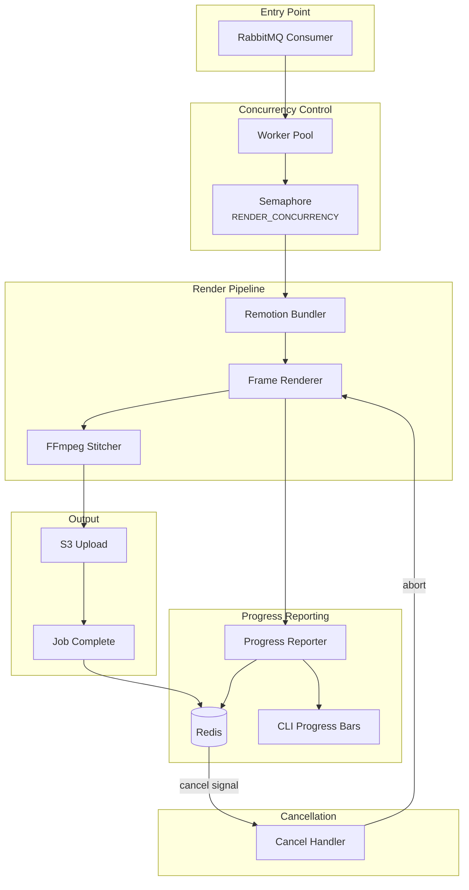
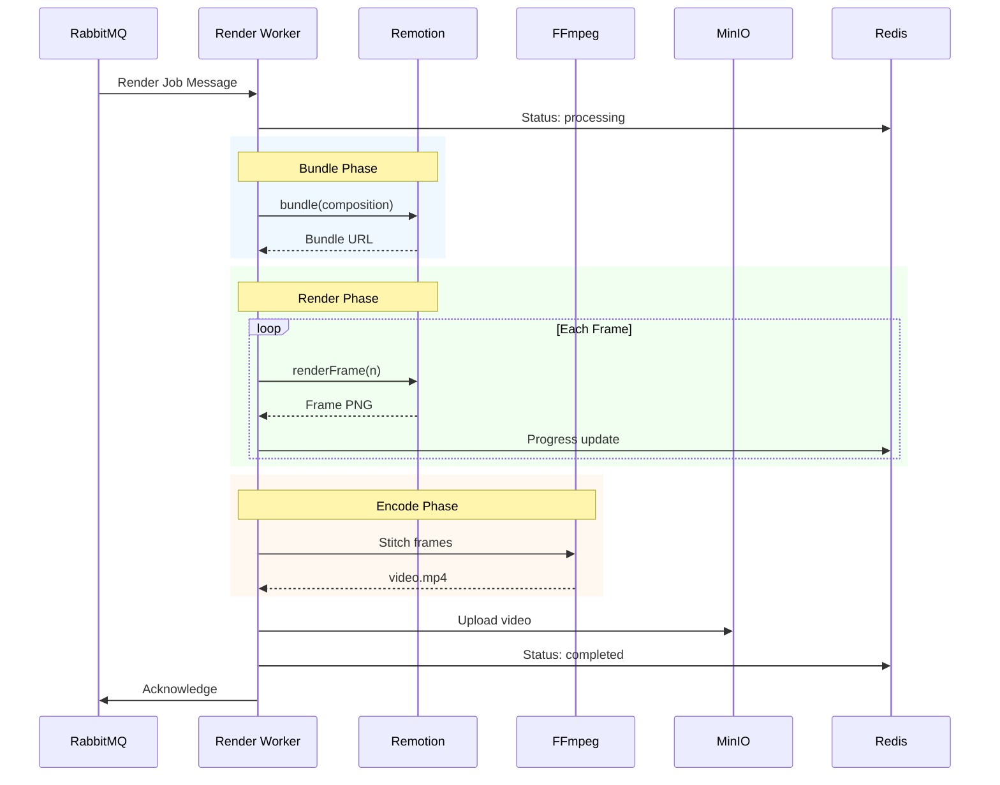
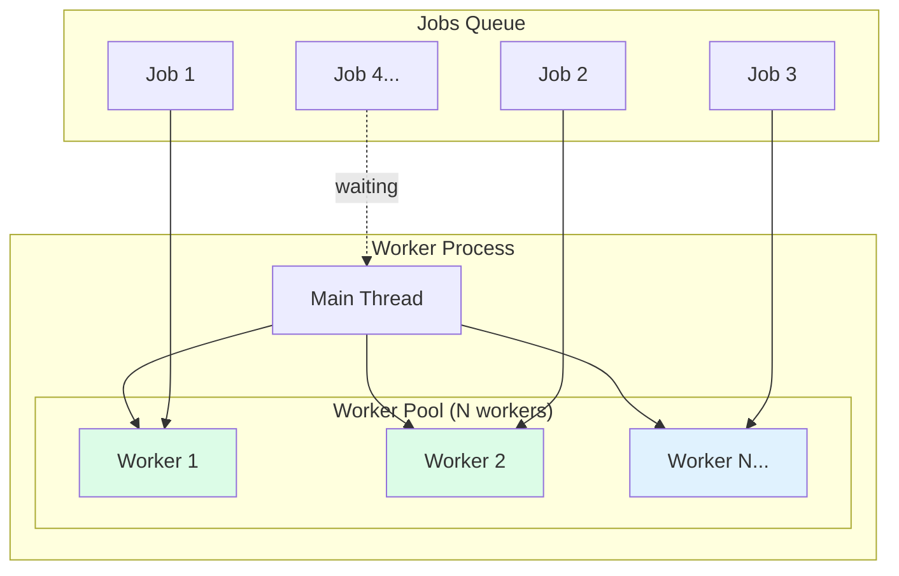
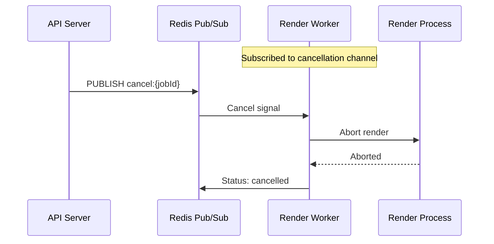

# Render Worker

Distributed video rendering engine using Remotion and FFmpeg.

## Architecture



## Rendering Flow



## Concurrency Model



## Real-Time Cancellation



## Progress UI

The worker uses `cli-progress` for real-time terminal visualization:

```
Render Jobs [████████░░░░░░░░░░░░] 2/5 jobs | Active: 3
┌─ Job render_abc123 ─────────────────────────────────────────┐
│ [████████████████████████░░░░░░░░░░░░░░] 65% | Encoding     │
└─────────────────────────────────────────────────────────────┘
┌─ Job render_def456 ─────────────────────────────────────────┐
│ [███████████░░░░░░░░░░░░░░░░░░░░░░░░░░░] 28% | Rendering    │
└─────────────────────────────────────────────────────────────┘
```

## Configuration

| Variable | Default | Description |
|----------|---------|-------------|
| `RABBITMQ_URL` | - | RabbitMQ connection |
| `REDIS_URL` | - | Status & cancellation |
| `S3_ENDPOINT` | - | MinIO/S3 endpoint |
| `S3_BUCKET` | `renders` | Output bucket |
| `RENDER_CONCURRENCY` | `2` | Parallel render jobs |
| `REMOTION_CHROME_PATH` | auto | Chromium path |

## Job Message Format

```json
{
  "jobId": "render_1234567890",
  "templateData": {
    "slides": [...],
    "totalDuration": 450
  },
  "options": {
    "fps": 30,
    "scale": 1,
    "format": "mp4",
    "quality": "high",
    "resolution": "1080p"
  }
}
```

## Resolution Presets

| Preset | Dimensions | Use Case |
|--------|------------|----------|
| `720p` | 1280×720 | Fast preview |
| `1080p` | 1920×1080 | Standard |
| `4k` | 3840×2160 | High quality |

## Quality Settings

| Quality | CRF | Description |
|---------|-----|-------------|
| `low` | 28 | Fast, smaller files |
| `medium` | 23 | Balanced |
| `high` | 18 | Better quality |
| `ultra` | 15 | Maximum quality |

## Docker Deployment

```dockerfile
FROM node:20-slim

# Install FFmpeg and Chromium
RUN apt-get update && apt-get install -y \
    ffmpeg \
    chromium \
    && rm -rf /var/lib/apt/lists/*

WORKDIR /app
COPY . .
RUN npm ci --production

ENV REMOTION_CHROME_PATH=/usr/bin/chromium

CMD ["npm", "run", "worker:render"]
```

## Running

```bash
# Development
npm run worker:render

# With custom concurrency
RENDER_CONCURRENCY=4 npm run worker:render

# Production (Docker)
docker-compose up render-worker
```

## Monitoring

Check worker health via Redis:
```bash
redis-cli KEYS "render:*"
redis-cli GET "render:job_123:status"
redis-cli GET "render:job_123:progress"
```
